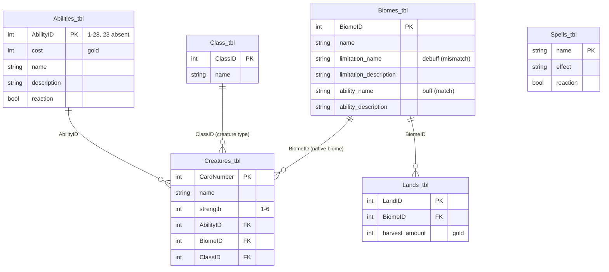

# Mystic — Artefact Elements

A complete anatomy and data-model specification for every physical artefact in Mystic.
It reconciles the four **visual north-star renders** (`visual-north-star/`) against the
**Master Tables workbook** (`Master Tables.xlsx - Mystic Artefact Descriptions and Metadata.xlsx`),
and is intended to serve two downstream purposes:

1. **Instructions** — precise, consistent vocabulary for the rulebook / playbook.
2. **Code-generated card designs** — a field-to-visual mapping explicit enough to drive
   programmatic layout (HTML/CSS/SVG print sheets, virtual-tabletop renders, etc.).

Companion document: `MYSTIC_MECHANICS.md` (gameplay rules). This document covers **what the
pieces are and what they carry**; the mechanics doc covers **how they are used**.

## Code-generated cards (design master)

The card designs are maintained as **code, not static files**:

- `site/js/card-data.js` — the master data (this document's appendices, as JS)
- `site/css/cards.css` — the design system; geometry tokens follow Premium-Print-Formats
  §4.3 (poker 63.5×88.9mm trim, ~3mm corner radius, ~3mm safe zone, symmetric backs)
- `site/js/cards.js` — the renderer (`creature` / `spell` / `land` / `tile`)

The website's "Artefacts" section renders live from these modules, so design iteration
happens in one place. Print export (PDF/X-1a with spot foil layers per Premium-Print-Formats
Part 6) is future work built on the same modules.

Design notes (current iteration):

- **Biome marks are vector icons** — nine hand-authored geometric SVGs on a 24×24 grid,
  single-color `currentColor` throughout (solid fills, `fill-rule="evenodd"` negative
  space, thick round-capped strokes). Web source of truth: `site/js/icons.js`; print
  masters: `site/assets/icons/biome/<slug>.svg`. Single-color geometry = clean
  spot-color / foil separations at any size. Motifs: Desert sun-over-dunes, Forest pine,
  Tundra snowflake, Plains wheat, Mountains twin peaks, Town gabled hall, Swamp cattails,
  Ocean wave crests, Cave arched mound. Each biome carries a muted accent color that sits
  beside the ivory/gold theme (CSS `--biome-*` vars): Desert `#BE8238` amber, Forest
  `#557A46` moss, Tundra `#7FA9BF` glacier, Plains `#A3A848` olive, Mountains `#7E8590`
  slate, Town `#A85A4A` brick, Swamp `#5F7A68` jade, Ocean `#3F6E8E` deep sea, Cave
  `#68586A` dusk violet. On cards the mark is a raw glyph (no housing); on tiles it sits
  in a parchment-inset gold hex; on the site medallions it keeps the parchment + gold ring.
  Two more marks join the set: **crossed swords** for strength (`MysticIcons.swords`,
  master `site/assets/icons/swords.svg`) — two diagonal blades, 180°-symmetric so it
  survives the mirrored opponent strip; it leads the creature's strength numeral in the
  footer lockup and the top strip. And the **flask** spell mark (`MysticIcons.flask`,
  master `site/assets/icons/flask.svg`) — bulb, neck, rim and liquid line in gold ink,
  replacing the old raster potion on the spell card's top-left chip.
- **Type marks remain raster** — the creature-type (`type-*`) icons still ship as
  transparent cutouts (the type medallion keeps its parchment + gold circle badge).
  Same vector treatment can follow in a later pass.
- **Rounded hexes** — the land tile and its biome marker clip to `#hexRound`, an inline
  SVG `clipPath` with subtly rounded vertices (polygon fallback kept).
- **Strength** — rendered as a crossed-swords device + bare gold **numeral** at bottom left (no diamond
  housing); the die roll adds to it in battle.
- **Art window** — 50% of the card height; on creature and land cards it narrows to
  **73% width, left-aligned**, with the chevron column filling the strip to its right
  (spells keep full-width art — they carry no facing). The card's **name is overlaid on
  the art's bottom edge** over an ivory scrim (SuperAI-style), and the class medallion is
  set into the art's bottom-right corner. Card titles are set at the same size as the
  rules text.
- **Opponent index** — the top edge of every card carries a **mirrored pill** (rotated
  180°, gold-ringed parchment) so players across the table can read it: creatures show
  strength + ability name, spells their name, lands their biome. The creature **footer
  echoes it upright** — the same pill, centered at the bottom, with the crossed-swords
  strength lockup inside. On **creature and spell
  cards** the rules text also repeats in a muted, two-line-clamped mirrored band
  directly above the art — bare rules text in both orientations (the name never heads
  the description, so nothing reads as a run-on). Land cards mirror their
  **match/mismatch pair** in the same band — flattened into one text run with a
  four-line clamp so both effects survive for the opponent's read.
- **Tile symmetry** — the land tile repeats its biome marker + harvest yield, side by
  side, on **alternating edges** — three pairs rotated 120° apart, pushed to the rim —
  equally spaced around the hex (3-fold rotational symmetry). Tiles have
  no facing and mark no ownership — orientation/ownership lives on the cards only
  (chevrons + mirrored index).
- **Orientation chevrons** — a top-aligned column of **six** smooth-edged upward
  chevrons beside the art signifies the facing direction of creature and land cards.
  On reaction creatures the golden shield sits in the same strip, directly below the
  chevrons (spells keep the shield on the right edge). Both are designated
  **hot-foil (烫金) spot elements**: at export they become a named "Foil Gold"
  separation flagged overprint per Premium-Print-Formats §1.8 / Part 6.
- **Annotation pattern** — the explainer panels are unified diagrams: numbered labels flank
  the artefact (vanlent.dev-style `01.` numerals fused with the text) and dashed connector
  lines, measured from the live DOM, point to each element's edge. No markers sit on the
  card face.

---

## 1. Sources and authority

| Source | Role | Authority |
| --- | --- | --- |
| Master Tables workbook (10 sheets) | Names, stats, abilities, spells, lands, biomes, classes, glossary, rules, component anatomy | **Data authority** |
| `visual-north-star/*.png` (4 renders) | Frame language, layout, typography, badge shapes | **Visual reference** |
| `MYSTIC_MECHANICS.md` + website | Previously published rules text | Secondary — see §6 drift notes |

Important: the north-star renders are **concept art, not data-accurate proofs**.
Example: the Dune render prints a "Shapeshifter" ability, but `Creatures_tbl` assigns Dune
AbilityID 26 (Silence); the Sandstorm spell does not exist in `Spells_tbl` at all. Treat their
**layout and styling** as canonical and their **text content** as placeholder.

Workbook sheet inventory:

| Sheet | Contents |
| --- | --- |
| `Overview` | Pivot: creature → strength (the `.tsv` export is this sheet only) |
| `Creatures_tbl` | 90 creatures: Card Number, Name, Strength, AbilityID, BiomeID, ClassID |
| `Abilities_tbl` | 27 abilities: AbilityID, Cost, Name, Description, Reaction? (ID 23 absent) |
| `Spells_tbl` | 35 spells: Name, Effect, Reaction? |
| `Lands_tbl` | 36 land cards: LandID, BiomeID, Harvest amount |
| `Class_tbl` | 10 creature classes |
| `Biomes_tbl` | 9 biomes: buff (match) and debuff (mismatch) pairs |
| `Glossary` | 22 defined terms (incl. visual conventions) |
| `Rules` | 21 rules (incl. component-relevant setup facts) |
| `Components` | Per-artefact element lists with board positions |

---

## 2. Shared design language (from the north-star renders)

All three card types share one frame system; the land tile is the odd artefact out (pure art).

| Token | Observed treatment |
| --- | --- |
| Ground | Deep navy / near-black |
| Border | Thin gold double rule with ornate filigree corner flourishes |
| Type badge | Hexagonal medallion, top center, gold icon on navy |
| Title | Gold serif small-caps, letterspaced |
| Subtitle | Gold italic script (flavor title / epithet) |
| Art window | Rounded rectangle, thin gold frame, full-bleed painted art |
| Bottom panel | Rules zone on navy: gold caps heading + ivory body text + italic flavor line |
| Corners | Small gold flourishes at bottom corners |

Badge shape semantics (shape carries meaning — keep this consistent in code):

| Shape | Meaning | Source |
| --- | --- | --- |
| Diamond / lozenge | Creature strength score | North-star renders; Glossary says "triangle on the left side" — see §6 |
| Circle (coin) | Gold cost | Spell render |
| Golden shield | Reaction (usable in response to another player's action) | Glossary, Rules |
| Hexagon | Biome identity | Type badge on cards; the tile shape itself |

---

## 3. Artefact anatomy

Positions below are from the `Components` sheet; render observations are noted alongside.

### 3.1 Creature card — white card back

Components sheet: **6 elements** — Biome (top left), summoning cost (top right), creature
strength (middle left), ability (bottom left), ability reaction shield (middle right),
creature type (bottom right).

North-star render (Bruna Sandtinkerer) shows: hex badge top **center**, title, subtitle,
art window, strength diamond bottom-left, ability block (name + rules text), flavor line.
Not shown: summoning cost, class icon, reaction shield.

Backing data: `Creatures_tbl` joined to `Abilities_tbl`, `Biomes_tbl`, `Class_tbl`.

### 3.2 Land card — black card back

Components sheet: **3 elements** — Biome (top left), harvest yield (listed "top left",
almost certainly top right — see §6), land image (center).

The file `kand-card-example.png` is the land-card example (filename typo). Its render
reuses the creature-card frame and shows creature-like content (strength diamond, ability
block) — treated as placeholder content in the shared frame; see §6.

Backing data: `Lands_tbl` joined to `Biomes_tbl`. 36 land cards — one per map tile.

### 3.3 Spell card — black card back

Components sheet: **2 elements** — spell description (bottom center), spell reaction
shield (middle right).

North-star render (Sandstorm) additionally shows: hex badge, title, subtitle, art window,
and a **gold coin cost badge "3"** — which conflicts with the Rules sheet ("Spells cost
1 gold to play"). See §6.

Backing data: `Spells_tbl` (name, effect, reaction flag).

### 3.4 Land tile — hexagonal board piece

Components sheet: **3 elements** — Biome (middle right), harvest yield (middle right),
land image (center). The Rules sheet adds: tiles carry a **diamond marker on the right
side** used to align orientation when building the map ("aligning the diamonds on the
right side of each tile"). The code-generated design (§5.4) drops the diamond: the
biome marker + harvest yield repeat on every edge, rotated 60° apart (6-fold
symmetry), so the tile reads the same from each of the six seats. Tiles carry no
facing or ownership — orientation is a card property (§5.1–5.3).

North-star render (Desert) shows: full-bleed painted biome scene with a subtle 3D rim —
**no** visible biome icon, harvest numeral, or orientation diamond. These markers must be
composited onto the art in the final design. See §6.

Backing data: the 36-tile map mirrors `Lands_tbl` (Rules: "The map consists of 36
hexagonal land tiles").

### 3.5 Gold

Currency tokens (any small tokens may substitute). Spent on summoning and spells;
earned by harvesting and selling. No fixed design.

### 3.6 Dice

One six-sided die per player ideally (sharing permitted). Resolves battles, abilities,
and biome effects.

### 3.7 Biome synergy chart

Reference card listing each biome's match buff and mismatch debuff (source:
`Biomes_tbl`, reproduced in Appendix E). Ideally one per player.

---

## 4. Data model

Key structural facts:

- **The creature roster is a 9 x 10 matrix**: each of the 9 biomes contributes exactly
  10 creatures, and within each biome the 10 creatures cover each of the 10 classes
  exactly once. 90 creatures total.
- **Strength**: range 1-6, sum 311, mean ~3.46. Distribution: 1x6, 2x15, 3x23, 4x28, 5x14, 6x4.
- **Per-biome strength budgets differ** (balance lever): Mountain 44, Tundra 43, Ocean 36,
  Plain 37, Town 33, Cave 32, Swamp 30, Desert 28, Forest 28.
- **Lands**: 36 cards = 4 per biome. Harvest yield runs 1-4 per biome, except Desert which
  runs 2-5 (the richest biome on average).
- **Abilities**: 27 defined (IDs 1-28, ID 23 missing). Each carries a gold cost (1-6) and a
  reaction flag. 10 of 27 are reactions.
- **Spells**: 35 defined. 10 of 35 are reactions.
- **Reaction convention**: golden shield icon (Glossary). Reaction abilities/spells may be
  played in response to another player's action.

Component-relevant facts from the Rules sheet:

- Two decks: **creature deck** (90) and **land/spell deck** (36 + 35 = 71).
- Starting resources: 1 creature card + 2 land/spell cards + 4 gold per player.
- **Sell a Creature**: discard from hand, gain gold equal to its strength score.
- Spells cost 1 gold and no action; abilities cost no action and (per Rules) no gold —
  but see §6 on `Abilities_tbl.Cost`.
- Win: control N adjacent tiles in an unbroken chain until the start of your next turn
  ("check" announcement at 7).

---

## 5. Field-to-visual mapping (code-generation spec)

### 5.1 Creature card

| Slot | Data source | Treatment |
| --- | --- | --- |
| Title | `Creatures_tbl.Name` | Gold serif small-caps, top |
| Subtitle (flavor title) | **not in data — gap** | Gold italic script |
| Biome badge | `Biomes_tbl` via `BiomeID` | Hex medallion; top center (render) / top left (Components) — pick one, see §6 |
| Summoning cost | **not in `Creatures_tbl` — gap** | ₲ mark + numeral, bare flat gold text, top right (no housing) |
| Strength | `Creatures_tbl.Strength` | Crossed-swords device + gold numeral + ability name in a gold-ringed parchment pill, bottom center — identical typography to the mirrored pill above, just upright |
| Ability name | `Abilities_tbl.Name` | In the top mirror strip and the footer lockup — not repeated in the rules panels |
| Ability rules text | `Abilities_tbl.Description` | Ivory body, bottom panel (bare text, no heading) |
| Ability cost | `Abilities_tbl.Cost` | Unused in render — see §6 |
| Reaction shield | `Abilities_tbl.Reaction?` | Flat gold shield (single-color, ivory bolt) below the chevron column (right strip), shown when 1 |
| Creature type | `Class_tbl` via `ClassID` | Class icon, bottom right |
| Flavor text | **not in data — gap** | Italic line, bottom |
| Art | asset pipeline (per creature) | Rounded-rect window, center |

### 5.2 Land card

| Slot | Data source | Treatment |
| --- | --- | --- |
| Biome | `Biomes_tbl` via `BiomeID` | Biome icon, top left |
| Harvest yield | `Lands_tbl.Harvest amount` | ₲ mark + numeral, bare flat gold text, top right (no housing) |
| Biome effects | `Biomes_tbl` buff/debuff | Match/mismatch run-in lines, bottom panel (no "LAND" heading) — flattened into the mirrored band above the art |
| Land image | asset pipeline (per biome) | Center art |

### 5.3 Spell card

| Slot | Data source | Treatment |
| --- | --- | --- |
| Title | `Spells_tbl.Name` | Gold serif small-caps |
| Spell mark | — | Vector flask glyph, top left (gold ink) |
| Cost | flat 1 (Rules) vs per-spell coin (render) — see §6 | ₲ mark + numeral, bare flat gold text, top right (no housing) |
| Effect | `Spells_tbl.Effect` | Rules text below the art, headed only "Spell" (reaction status lives on the shield, not the heading) |
| Reaction shield | `Spells_tbl.Reaction?` | Flat gold shield (single-color, ivory bolt), right edge, shown when 1 |
| Art | asset pipeline (per spell) | Art window |

### 5.4 Land tile

| Slot | Data source | Treatment |
| --- | --- | --- |
| Land image | asset pipeline (per biome) | Full-bleed hex art |
| Biome marker | `Biomes_tbl` via `BiomeID` | Icon, middle right (per Components) |
| Harvest yield | `Lands_tbl.Harvest amount` | Numeral, middle right (per Components) |
| Biome marker + harvest yield ×3 | `Biomes_tbl` icon + `Lands_tbl.Harvest amount` | Alternating edges, rotated 120° apart, at the rim and left-aligned along each edge plane — equally spaced, 3-fold symmetry; no facing/ownership (supersedes the Rules' orientation diamond). Yield is a hexagon chip matching the biome marker (gold rim, parchment inset) carrying the ₲ mark + numeral, set apart by an inner hexagonal frame line (the biome marker has none) |

---

## 6. Discrepancies and open questions

1. **Summoning cost is specced but has no data.** Components places it top-right on the
   creature card; `Creatures_tbl` has no cost column, and the render omits it. Is summoning
   cost derived from strength, or a new column to be added?
2. **Strength badge shape**: Glossary says "triangle on the left side"; the render uses a
   diamond at bottom-left. Confirm final shape and position.
3. **Spell cost**: Rules say all spells cost 1 gold; the Sandstorm render shows a coin
   badge with "3". Flat cost or per-spell costs?
4. **Ability costs**: `Abilities_tbl.Cost` (1-6 gold) contradicts the Rules sheet
   ("Abilities do not cost gold or actions"). Which is current?
5. **Land-card example content**: the Dune render shows creature-like content (strength,
   ability) although Components specces land cards as biome + harvest + image only.
   Presumed placeholder — confirm the final land-card layout is the minimal one.
6. **Land-tile markers absent from render**: biome icon, harvest numeral, and the
   orientation diamond (Rules) are not visible on the Desert tile render. Confirm they are
   to be composited on the art, and where.
7. **Biome table drift** between `Biomes_tbl` and the website's published table
   (`MYSTIC_MECHANICS.md`): Ocean match is "draw two cards" (workbook) vs "gain 4 gold"
   (site); Forest match "Camouflaged" vs "Hidden"; Town mismatch "Bartering" vs "Haggled";
   Mountain match adds "spells and abilities do work"; Plain match adds "no roll penalty";
   Desert explicitly applies to summonings. **Resolved in favor of the published table** —
   it is the player-facing wording, and the land card now prints the match/mismatch pair
   from it (`card-data.js` synced, texts tightened for card space). The XLSX wording is
   superseded.
8. **AbilityID 23 is missing** from `Abilities_tbl` (sequence jumps 22 to 24). Retired
   ability or accidental deletion?
9. **Example-render content is not data-accurate** (Dune's printed ability vs its
   AbilityID 26 "Silence"; Sandstorm absent from `Spells_tbl`; Bruna's "Tinkerer" vs
   AbilityID 22 "Shield"). Fine for concept art — must not leak into generated cards.
10. **Components typo**: land card lists both biome and harvest yield at "top left" —
    one is presumably top right.
11. **Missing data for full card generation**: per-creature flavor titles and flavor text,
    summoning costs, per-creature/spell art asset mapping, and a canonical biome/class icon
    set are all absent from the workbook and must be authored before code generation.

---

## Appendix A — Creature roster (90), joined

| # | Name | Str | Ability | Biome | Class |
| --- | --- | --- | --- | --- | --- |
| 1 | Radiance | 4 | Burrow | Desert | Dragon |
| 2 | Dune | 4 | Silence | Desert | Giant |
| 3 | Panda-gger | 3 | Copy cat | Desert | Elite |
| 4 | Sand wraith | 3 | Shapeshift | Desert | Demon |
| 5 | Krukk Sunscorcher | 2 | Echo | Desert | Orc |
| 6 | Bruna Sandtinkerer | 2 | Shield | Desert | Dwarf |
| 7 | Fire Spirit | 2 | Spontaneous Combustion | Desert | Angel |
| 8 | Desert Elemental | 2 | Elemental Adaptation | Desert | Elemental |
| 9 | Siren | 4 | Stun | Desert | Mermaid |
| 10 | Skelter | 2 | Golem Body | Desert | Undead |
| 11 | Druid | 4 | Spell Deflect | Forest | Elite |
| 12 | Sylvanus | 5 | Flight | Forest | Dragon |
| 13 | Pummelpotamus | 3 | Neutralize | Forest | Giant |
| 14 | Nyxthorn | 2 | Fear | Forest | Demon |
| 15 | Zulgar the Wise | 2 | Copy cat | Forest | Orc |
| 16 | Gnarlroot | 2 | Telekinesis | Forest | Dwarf |
| 17 | Necro | 4 | Mind Control | Forest | Undead |
| 18 | Fairy | 1 | Flight | Forest | Angel |
| 19 | Roggy | 4 | Shield | Forest | Elemental |
| 20 | Triton | 1 | Burrow | Forest | Mermaid |
| 21 | Scavenge | 4 | Stealth | Cave | Elite |
| 22 | Terrafirma | 3 | Shapeshift | Cave | Giant |
| 23 | Pebbles | 3 | AOE | Cave | Dragon |
| 24 | Zirax | 2 | Poison | Cave | Demon |
| 25 | Torgath | 3 | Burrow | Cave | Orc |
| 26 | Grimmalkin | 3 | Golem Body | Cave | Dwarf |
| 27 | Tomb Dweller | 3 | Telekinesis | Cave | Undead |
| 28 | Treasure Guardian | 4 | Multi-attack | Cave | Angel |
| 29 | Cave Elemental | 4 | Mind Control | Cave | Elemental |
| 30 | Nebula | 3 | Mimicry | Cave | Mermaid |
| 31 | Granite | 5 | Golem Body | Mountain | Elite |
| 32 | Rexxie | 3 | Spontaneous Combustion | Mountain | Giant |
| 33 | Volcandor | 6 | Multi-attack | Mountain | Dragon |
| 34 | Korath, the Mountain King | 5 | Neutralize | Mountain | Demon |
| 35 | Gorzak Warbringer | 5 | Echo | Mountain | Orc |
| 36 | King Krag | 4 | Command | Mountain | Dwarf |
| 37 | Wraps | 3 | Time warp | Mountain | Undead |
| 38 | Sky | 6 | Silence | Mountain | Angel |
| 39 | Earth Elemental | 4 | Elemental Adaptation | Mountain | Elemental |
| 40 | Relic | 3 | Mimicry | Mountain | Mermaid |
| 41 | Quiver | 3 | Invisibility | Swamp | Elite |
| 42 | Quagmire Montrosity | 4 | Spell Deflect | Swamp | Giant |
| 43 | Muckwing | 3 | Shield | Swamp | Dragon |
| 44 | Imp | 1 | Distraction | Swamp | Demon |
| 45 | Grimlok | 3 | Support | Swamp | Orc |
| 46 | Mud | 2 | Echo | Swamp | Dwarf |
| 47 | Mordecai | 2 | Poison | Swamp | Undead |
| 48 | Forgotten | 4 | Fear | Swamp | Angel |
| 49 | Swamp Elemental | 3 | Poison | Swamp | Elemental |
| 50 | Lilith | 5 | Mind Control | Swamp | Mermaid |
| 51 | Iviq | 3 | Silence | Tundra | Elite |
| 52 | Mittens | 4 | Resistance | Tundra | Undead |
| 53 | Yeti | 4 | Elemental Adaptation | Tundra | Giant |
| 54 | Okami | 5 | Command | Tundra | Dragon |
| 55 | Crystallos | 4 | Support | Tundra | Angel |
| 56 | Abaddon | 6 | Time warp | Tundra | Demon |
| 57 | Grommash Frostreaper | 5 | Fear | Tundra | Orc |
| 58 | Frostbite | 4 | Resistance | Tundra | Dwarf |
| 59 | Ice Elemental | 4 | AOE | Tundra | Elemental |
| 60 | Svala | 4 | Multi-attack | Tundra | Mermaid |
| 61 | Meridian | 4 | Silence | Ocean | Elite |
| 62 | Leviathan | 6 | Fear | Ocean | Giant |
| 63 | Typhoon | 3 | Elemental Adaptation | Ocean | Dragon |
| 64 | Krakenos | 5 | Distraction | Ocean | Demon |
| 65 | Krakenkrog | 5 | Neutralize | Ocean | Orc |
| 66 | Kelpfolk | 1 | Spell Deflect | Ocean | Dwarf |
| 67 | Discarded Pirate | 1 | Time warp | Ocean | Undead |
| 68 | Aquilos | 3 | Shapeshift | Ocean | Angel |
| 69 | Water Elemental | 4 | Elemental Adaptation | Ocean | Elemental |
| 70 | Aquaria | 4 | Elemental Adaptation | Ocean | Mermaid |
| 71 | Tatsuo | 1 | Stealth | Town | Elite |
| 72 | Adorable Giant | 5 | Support | Town | Giant |
| 73 | Obsidian | 4 | Distraction | Town | Dragon |
| 74 | Kraven | 4 | AOE | Town | Demon |
| 75 | Mugglug The Stubborn | 2 | Golem Body | Town | Orc |
| 76 | Shade Walker | 3 | Shield | Town | Dwarf |
| 77 | Zombie Horde | 2 | Multi-attack | Town | Undead |
| 78 | Baylie | 5 | Stun | Town | Angel |
| 79 | Shaydie | 3 | Spontaneous Combustion | Town | Elemental |
| 80 | Lunavira | 4 | Stealth | Town | Mermaid |
| 81 | Grasstalker | 2 | Mimicry | Plain | Elite |
| 82 | Storm Colossus | 5 | Resistance | Plain | Giant |
| 83 | Bladewing | 4 | Flight | Plain | Dragon |
| 84 | Vortexus | 5 | Mimicry | Plain | Demon |
| 85 | Brakka the Ferocious | 4 | Command | Plain | Orc |
| 86 | Aero | 5 | Invisibility | Plain | Dwarf |
| 87 | Specter | 2 | Burrow | Plain | Undead |
| 88 | Ophanim | 3 | Telekinesis | Plain | Angel |
| 89 | Air Elemental | 3 | Neutralize | Plain | Elemental |
| 90 | Zephyr | 4 | Telekinesis | Plain | Mermaid |

## Appendix B — Abilities (27)

| ID | Cost | Name | Reaction | Description |
| --- | --- | --- | --- | --- |
| 1 | 1 | Invisibility | No | Immune to attacks while in its native biome. Attacking reveals the creature until the start of the next turn. |
| 2 | 3 | Multi-attack | Yes | Roll the die twice in combat and choose the better outcome. |
| 3 | 3 | Copy cat | Yes | Copy the ability of an adjacent ally until the start of the next turn. |
| 4 | 3 | Mimicry | Yes | Copy the ability of an adjacent enemy until the start of the next turn. |
| 5 | 3 | Stun | No | Roll above 3 to stun an adjacent enemy, disabling its movement and attack until the end of its next turn. |
| 6 | 2 | Spell Deflect | Yes | Roll above 3 to deflect spells or abilities targeting the creature, using them instead. |
| 7 | 5 | Fear | No | Roll above 4 to force adjacent enemies to the furthest unoccupied tile; destroy them if none exists. |
| 8 | 5 | Command | No | Roll above 3 to move all adjacent allies one space; this movement can initiate battles. |
| 9 | 6 | Time warp | No | Roll above 3 to skip one action of an adjacent enemy player on their next turn. |
| 10 | 4 | Spontaneous Combustion | Yes | Roll before attack or defense: above 3 destroys the enemy; below 4 destroys this creature instead. |
| 11 | 2 | Resistance | Yes | Negates negative movement effects from biomes for this creature. |
| 12 | 4 | Golem Body | Yes | Roll above 3 when defending to avoid the attack. |
| 13 | 1 | Stealth | No | Move onto an occupied enemy tile without conflict; if still occupied at end of turn, conflict initiates. |
| 14 | 6 | Flight | No | Move up to three tiles, ignoring occupied tiles and biomes; must land before claiming or battling. Does not work in caves. |
| 15 | 3 | AOE | No | Use additional actions to attack all adjacent enemies; the same creature can be attacked multiple times. |
| 16 | 1 | Poison | No | Cannot be destroyed when initiating an attack. |
| 17 | 4 | Distraction | Yes | Reduces adjacent enemies' battle strength by one. |
| 18 | 5 | Telekinesis | No | Move an adjacent creature to an unoccupied adjacent tile. Forest restrictions apply. |
| 19 | 5 | Mind Control | No | Force an adjacent creature to move to an unoccupied tile. Cave and forest restrictions apply. |
| 20 | 3 | Elemental Adaptation | Yes | +2 Strength when in a matching biome. |
| 21 | 2 | Support | No | Adjacent allies gain +2 Strength on attack. |
| 22 | 2 | Shield | Yes | Adjacent allies gain +2 Strength on defense. |
| 24 | 1 | Echo | Yes | When a spell targets this creature, roll: above 3 doubles the effect; below 3 negates it. |
| 25 | 2 | Burrow | No | On its matching biome, use an action to move to any other unoccupied tile of the same biome. |
| 26 | 5 | Silence | No | Roll above 4 to prevent spells on adjacent tiles and creatures until the next turn. |
| 27 | 5 | Neutralize | Yes | In a matching biome, adjacent enemy creatures cannot use abilities. |
| 28 | 3 | Shapeshift | No | Change biome affiliation to the current biome once per turn, until turn's end. |

## Appendix C — Spells (35)

| Name | Reaction | Effect |
| --- | --- | --- |
| Abundance | No | Gain 3 additional actions this turn. |
| Alliance | No | Draw the top 10 creature cards; add one Dragon to your hand (revealed); shuffle the rest back. |
| Armor | Yes | Prevents loss in battle. Play before attack rolls. |
| Barrier | No | Play on an enemy land tile: its creatures cannot move, attack, or be attacked there; spells have no effect. Lasts until end of your next turn. |
| Conjure | No | Restore a spell from the discard pile to your hand; it cannot be played until next turn. |
| Conquest | No | Take control of an enemy's unoccupied tile; add the land card to your hand. |
| Dimensional Door | No | Create a tunnel between two tiles; creatures move or attack as if adjacent. Lasts until end of next turn. |
| Domination | No | Move an enemy creature to an adjacent land tile. Cave and forest restrictions apply. |
| Espionage | No | Force an opponent to reveal all creature cards in hand and discard one of their choosing. |
| Fireball | Yes | Deal 3 damage to an enemy creature. Play after attack roll. |
| Illusionary Double | Yes | Move an attacked creature to an unoccupied tile, causing the attack to fail. Play before attack rolls. Cave and forest restrictions apply. |
| Invisibility | No | A creature moves through enemy-occupied tiles; unoccupied tiles entered do not change ownership; conflict if still on an enemy tile at turn end. |
| Levitation | No | Ignore biome restrictions for one creature this turn. |
| Lightning | Yes | Deal 4 damage to an enemy creature. Play after attack roll. |
| Manipulation | No | Control an enemy creature to attack another adjacent enemy; it cannot use abilities. |
| Meteor Shower | Yes | Target a biome: all creatures attacking or defending on it have -5 strength until end of next turn. Play before attack roll. |
| Nullify | Yes | Prevent an opponent's spell from activating; discard it. |
| Pacify | Yes | Prevent an enemy creature from attacking or using abilities until end of its turn. |
| Prosperity | No | Gain 2 gold and 2 cards from either deck. |
| Protection Ward | No | Play on a land tile you own: enemies cannot enter, attack, or cast spells on it until end of next turn. |
| Reanimate | No | Resummon an undead creature from the discard pile onto any tile. Free of action; gold costs apply. |
| Rebellion | No | Remove an enemy-controlled unoccupied tile; shuffle its land card back into the deck. |
| Reinforce | No | Summon a creature onto an unoccupied land tile you own. Free of action; gold costs apply. |
| Resurrection | No | Revive a defeated creature from the discard pile into your hand. |
| Reversal | No | Switch direction of play; gain an additional action if only 2 players. |
| Surveillance | No | Force an opponent to reveal 2 land cards from hand; take one. |
| Swiftness | No | Gain 3 additional movement actions. |
| Switch | No | Swap positions of two adjacent creatures, ignoring biome restrictions. |
| Teleport | No | Move one allied creature to any unoccupied tile, ignoring biome restrictions. |
| Terraform | No | Switch two adjacent unoccupied land tiles. |
| Terrify | Yes | Play on an allied creature: attacking creatures get -2 strength until end of your next turn. Play before rolls. |
| Usurp | No | Summon a creature onto an opponent's unoccupied land tile. Free of action; gold costs apply. |
| Warp | No | Move an enemy creature to any unoccupied tile. Ends your turn immediately. |
| Wealth | No | Gain 6 gold. |
| Wealth Drain | No | All opponents lose 5 gold. |

## Appendix D — Land cards (36)

Four land cards per biome. Harvest yield (gold per harvest):

| Biome | LandIDs | Harvest yields |
| --- | --- | --- |
| Desert | 1-4 | 2, 3, 4, 5 |
| Forest | 5-8 | 1, 2, 3, 4 |
| Plain | 9-12 | 1, 2, 3, 4 |
| Tundra | 13-16 | 1, 2, 3, 4 |
| Mountain | 17-20 | 1, 2, 3, 4 |
| Town | 21-24 | 1, 2, 3, 4 |
| Swamp | 25-28 | 1, 2, 3, 4 |
| Ocean | 29-32 | 1, 2, 3, 4 |
| Cave | 33-36 | 1, 2, 3, 4 |

## Appendix E — Biomes (9)

| ID | Biome | Mismatch debuff | Match buff |
| --- | --- | --- | --- |
| 1 | Desert | **Scorched** — lose 1 gold whenever a creature enters (incl. summoning) | **Conditioned** — gain 1 gold whenever a creature enters (incl. summoning) |
| 2 | Forest | **Entangled** — cannot enter and leave on the same turn | **Camouflaged** — +2 strength on defense |
| 3 | Plain | **Exposed** — -1 to all rolls | **Ranged** — may attack from an additional tile away, no roll penalty |
| 4 | Tundra | **Frostbitten** — -2 strength | **Acclimatized** — +2 strength |
| 5 | Mountain | **Isolated** — spells and abilities do not work on this creature | **Resourceful** — +2 gold when harvesting; spells and abilities do work |
| 6 | Town | **Bartering** — harvest: +1 gold per adjacent ally, -2 per adjacent enemy | **Negotiator** — harvest: +2 gold per adjacent ally, -1 per adjacent enemy |
| 7 | Swamp | **Stuck** — costs 2 actions to move into or out of | **Evolved** — skip swamp tiles; only 1 action to move into or out of |
| 8 | Ocean | **Unlucky** — on enter, roll: on 1, discard two non-land cards | **Lucky** — on enter, roll: on 6, draw two cards from either deck |
| 9 | Cave | **Trapped** — may only exit from the direction entered | **Nocturnal** — may exit in any direction |

## Appendix F — Classes (10)

| ID | Class |
| --- | --- |
| 1 | Dragon |
| 2 | Orc |
| 3 | Elite |
| 4 | Undead |
| 5 | Elemental |
| 6 | Angel |
| 7 | Demon |
| 8 | Giant |
| 9 | Mermaid |
| 10 | Dwarf |
