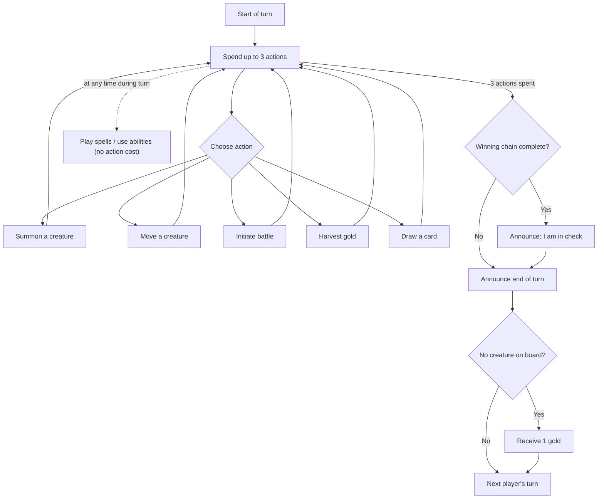
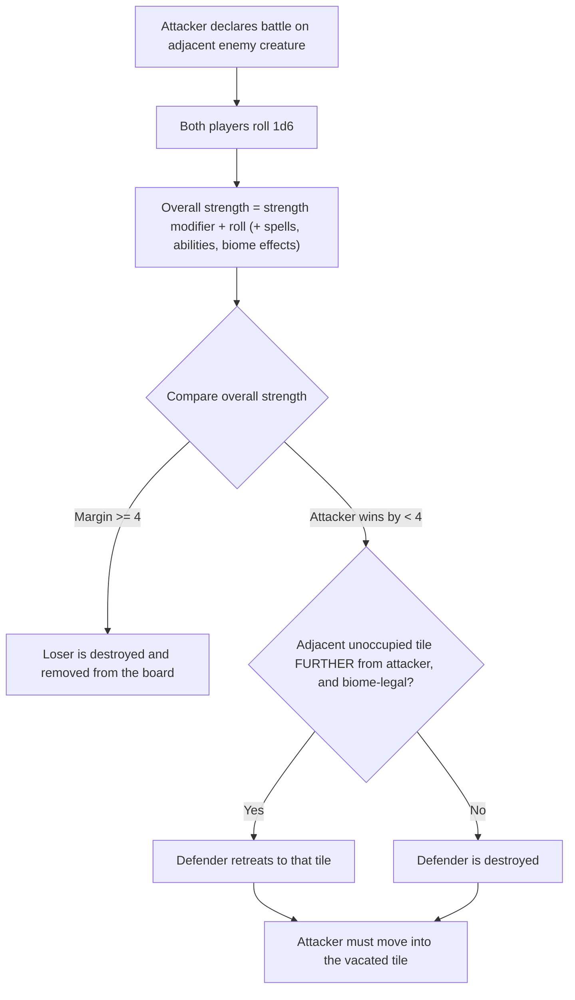

# Mystic Manuevers — Game Mechanics Knowledge Base

> **Purpose:** This document is the authoritative mechanics reference for Mystic Manuevers. It is intended to serve as a contextual knowledge base for software that virtualises the game (digital implementation / rules engine) and for physical production (components, card layouts, print assets).
>
> **Sources:** `Mystic Playbook V2.pdf` (3-page illustrated rulebook), `Playbook Redo - Smaller Version.svg` (8-page rulebook redo, newest), `Playbook Redo.svg` (same rule text), `Both pages.pdf` (exported biome chart pages), and an authoritative biome-mapping table supplied by the game authors (which supersedes the chart layout in `Both pages.pdf`).
>
> **Note on spelling:** Original component spellings are preserved where quoted, including "Manuevers" (title) and "Scortched" (Desert mismatch). Obvious rulebook typos ("you8r", "interactes", "recieves") are normalised in prose.

---

## 1. Overview

> "Mystic Manuevers is a fantasy strategy game that will take you and your friends through a magical world of conquest."

| Property | Value |
| --- | --- |
| Players | 2–6 |
| Actions per turn | 3 |
| Combat | Roll dice to battle (1 × six-sided die per combatant) |
| Board | Hexagonal land tiles, assembled into a single continent at setup |
| Designers | Daniel Schormann & Don Kruger |

Core loop: summon creatures onto land tiles, manoeuvre them across a hex map, claim and harvest land for gold, battle adjacent enemy creatures, and exploit (or suffer) biome synergies — all in service of completing a winning chain of connected tiles (3–7, agreed at setup) and holding it for a full round.

---

## 2. Components

| Component | Description |
| --- | --- |
| **Land tiles** | Hexagonal tiles, each belonging to one of the 9 biomes. Each tile displays a gold harvest value. Assembled by the players into the map at setup. |
| **Creature cards** | One deck. Summoned onto the tile matching a land card. |
| **Land cards** | Part of the "Lands and Spells" deck. Each land card matches one specific land tile. |
| **Spell cards** | Part of the "Lands and Spells" deck. Free to play (no gold, no actions). |
| **Gold pieces** | Currency for summoning creatures. |
| **Die** | One six-sided die (d6), used for battles and certain biome effects. |

---

## 3. Card Anatomy

### 3.1 Creature card

| Position | Element | Meaning |
| --- | --- | --- |
| Top-left corner | **Biome** | The creature's biome; compared against the biome of the land tile it occupies to determine match/mismatch effects. |
| Top-right corner | **Gold cost** | Amount of gold required to summon the creature. |
| Above the name | **Strength modifier** | Added to the creature's battle die roll, both when attacking and defending. |
| Bottom-right | **Creature type** | One of the 10 creature types (see §8). |
| Bottom-right corner | **Lightning bolt** | If present, the creature's ability can be used as a **reaction**. |

### 3.2 Land card

> "Each land tile has a matching land card. When a creature is summoned, the land card is placed on the land tile to signify who controls the tile. The amount of gold received when harvesting is indicated in the bottom left corner of the land card."

- Placed onto its matching land tile during summoning, in the controlling player's orientation.
- After its single use for a summon, its purpose is purely to signify **control** of the tile.

### 3.3 Spell card

> "Spells can be played on your turn and do not cost gold. If a spell has a lightning bolt in the bottom right corner, it can be played as a reaction."

- Spells cost **no gold and no actions** to play.
- A **lightning bolt** (bottom-right) means the spell can be played as a reaction.

### 3.4 Reactions (all card types)

> "Reactions can only be done if an opponent does something that directly affects this creature."

- Marked by a lightning bolt icon.
- Trigger condition: an opponent's action directly affects your creature.

---

## 4. Setup

1. **Share the tiles:** Divide the land tiles as evenly as possible among the players — each player's pile is what they will build the map from.
2. **Build the map:** Place one land tile down randomly. Players then take turns placing tiles from their own pile in whatever configuration they desire. *Constraint: the map must be connected as a single continent.*
3. **Build the decks:** Divide the cards into two decks — the **Creature deck** and the **Lands and Spells deck**.
4. **Choose first player:** Roll the die to see who starts.
5. **Opening hands:** Each player draws **1 creature card** and **2 land/spell cards**.
6. **Starting gold:** Each player receives **4 gold pieces** from the shared supply.
7. **Orientation:** All players choose an orientation on the board for their cards; orientation signifies ownership of cards on the board. Orientation follows seating — each player's cards are placed readable from where they sit (up to six players, one per side of the hexagon).

**Safety net rule:** At the end of each turn, if you do not have a creature on the board, you receive 1 gold piece.

---

## 5. Turn Structure

- Each player gets **3 actions per turn**.
- During your turn you may additionally **play spell cards** and **use abilities** — neither costs actions.
- **Abilities** do not cost actions, but can only be activated **once** unless otherwise stated (see Open Questions — the scope of "once" is undefined).
- When your 3 actions are completed, you **announce the end of your turn**.

### Available actions

| # | Action | Summary |
| --- | --- | --- |
| 1 | **Summon a creature** | Play creature card + matching land card; pay gold cost. |
| 2 | **Move a creature** | Move one of your creatures to an adjacent tile. |
| 3 | **Initiate battle** | Attack an enemy creature on an adjacent tile. |
| 4 | **Harvest gold** | Collect gold from a land tile occupied by your creature. |
| 5 | **Draw a card** | Draw a card. |

---

## 6. Core Mechanics

### 6.1 Summoning

- Requires **both a creature card and a land card** in your hand.
- **Pay the creature's gold cost** (top-right of the creature card).
- The creature can only be summoned onto the land tile that **matches the land card** being used.
- Placement: put your land card on its matching land tile **in your orientation**, then place the creature card on top of it.
- Each land card can only be used **once** to summon a creature.

### 6.2 Movement

- Costs **1 action** to move one of your summoned creatures to an **adjacent tile** (hex adjacency: up to 6 neighbouring tiles).
- When a creature moves, any land card it was on **remains where it is**.
- Biome effects may alter movement costs or restrict movement (see §7), e.g. Swamp's *Stuck* makes moving into or out of cost 2 actions.

### 6.3 Claiming land

- If your creature moves onto a land tile that has a land card belonging to **another player**, change the orientation of that land card to your orientation — you now control it.
- **Unoccupied** land tiles with land cards can be claimed by any player simply by moving a creature onto the tile. Defend your land.
- Tiles are controlled by having either your **creature card** or your **land card** on them.

### 6.4 Harvesting gold

- Costs **1 action**. You must have a creature on a land tile.
- Gold received = the **value demarcated on the land tile** (also shown bottom-left of the matching land card).
- A creature can harvest **multiple land tiles in one turn** (each harvest is an action), but **each land tile can only be harvested once per turn**.
- Biome effects modify harvest yield (see §7: *Resourceful*, *Negotiator*, *Haggled*).

### 6.5 Battle

- A battle can be initiated (1 action) by a creature against an **enemy creature on an adjacent tile**.
- Both players roll a **six-sided die**.
- **Overall strength = strength modifier + die roll.** Spells, abilities and biome synergies can all affect the outcome.
- The creature with the **highest overall strength** wins.

**Outcomes:**

| Result | Effect |
| --- | --- |
| Winner leads by **more than 3** (i.e. margin ≥ 4) | The losing creature is **destroyed** and removed from the board. |
| **Attacker** wins by **less than 4** | The defender must **retreat** to an adjacent unoccupied tile that is **further away from the attacking creature** than its current tile. If no such tile exists — because further tiles are **occupied** or the tile would be **past the map's edge** — the defender is **destroyed**. The attacker **must** move into the vacated tile. |

**Biome interaction with retreats:** Biome movement restrictions also apply to battle outcomes. If a defending creature loses by less than 4 but cannot legally move out of its current biome due to biome restrictions, it is **destroyed regardless**, even if unoccupied adjacent tiles exist. *Exception:* this does not apply to biomes that require multiple actions to move into or out of (e.g. Swamp under *Stuck*).

### 6.6 Worked example (from the rulebook)

- **Troll**: strength modifier +2; rolls a 4 → overall strength **6**.
- **Giant Spider**: strength modifier +3; rolls a 5 → overall strength **8**.
- Giant Spider wins by 2, which is less than 4 → the Troll is **not destroyed** but must retreat to an adjacent unoccupied tile **further away from** the Giant Spider; if no further tile exists (occupied or past the map's edge), the Troll is **destroyed** instead. The Giant Spider **must** move into the vacated tile.

---

## 7. Biome Synergies

- Every creature and every land tile belongs to a **biome**.
- Whenever a creature **interacts with a new land tile**, consult the chart below:
  - **Match** (creature biome = tile biome) → the creature is **buffed**.
  - **Mismatch** (biomes differ) → the creature is **debuffed**.
- Biome synergies must be considered whenever performing **any** actions, including battle.

### 7.1 Biome synergy chart (authoritative)

| Biome | Match (buff) | Mismatch (debuff) |
| --- | --- | --- |
| **Desert** | **Conditioned:** Gain one gold when your creature enters or leaves | **Scortched:** Lose one gold when your creature enters or leaves |
| **Forest** | **Hidden:** Gain +2 strength when defending | **Tangled:** Your creature can not enter and leave this biome on the same turn |
| **Tundra (Ice)** | **Acclimatized:** +2 strength | **Frostbitten:** -2 strength |
| **Plains** | **Ranged:** Can attack creatures from an additional tile away. If the attack is done this way and is successful, your creature moves into the new tile without changing ownership of the skipped tile | **Exposed:** -1 to all rolls |
| **Mountains** | **Resourceful:** +2 gold when harvested | **Isolated:** Spells and abilities that directly affect this creature do not work |
| **Town** | **Negotiator:** +2 gold for each adjacent allied creature. -1 gold for each adjacent enemy creature when harvested | **Haggled:** +1 gold for each adjacent allied creature and -2 gold for each adjacent enemy creature when harvested. |
| **Swamp** | **Evolved:** Completely skip swamp tiles for 1 action. Only costs 1 action to move into or out of. | **Stuck:** Costs 2 actions to move into or out of. |
| **Ocean** | **Lucky:** When you enter, roll a die. If the outcome is 6, gain 4 gold. | **Unlucky:** When you enter, roll a die. If the outcome is 1, discard two non-land cards from your hand. |
| **Cave** | **Nocturnal:** A creature can navigate out of a cave in any direction. | **Trapped:** A creature may only exit this tile from the direction they entered. Spell and abilities are not affected by this restriction. |

> **Provenance note:** The exported chart in `Both pages.pdf` shows an older layout in which several rows were mapped to different biomes (e.g. Tundra shown with Conditioned/Scortched, Mountains with Acclimatized/Frostbitten, Cave with Resourceful/Isolated). The table above reflects the final author-supplied mapping and should be treated as correct. The mid-edit image positions in `Playbook Redo - Smaller Version.svg` corroborate the new mapping (flame/Desert icon on the Conditioned/Scortched row, snow/Tundra on Acclimatized/Frostbitten, mountain on Resourceful/Isolated, wave/Ocean on Lucky/Unlucky, cave on Nocturnal/Trapped).

### 7.2 Effect categories (implementation view)

| Category | Effects |
| --- | --- |
| Gold on enter/leave | Conditioned, Scortched |
| Strength modifiers | Hidden (+2 defending), Acclimatized (+2), Frostbitten (-2), Exposed (-1 to all rolls) |
| Movement cost / restriction | Evolved, Stuck, Tangled, Trapped, Nocturnal |
| Harvest yield | Resourceful, Negotiator, Haggled |
| Spell/ability immunity | Isolated |
| Attack range | Ranged |
| On-enter die roll | Lucky, Unlucky |

---

## 8. Taxonomies

### 8.1 Biomes (9)

Forest · Town · Cave · Plains · Mountains · Ocean · Swamp · Desert · Tundra

### 8.2 Creature types (10)

Angel · Demon · Dragon · Dwarf · Elemental · Elite · Orc · Mermaid · Giant · Undead

*(No mechanical effects for creature types are defined in the sources — see Open Questions.)*

---

## 9. Win Condition

- **Winning chain size is agreed upon at the start of the game: 3–7 connected tiles.** Lower numbers make quicker games; higher numbers make longer games. Recommended: **8 − n**, where *n* is the number of players.
- To win you must **control the agreed number of adjacent land tiles** until the **start of your next turn**.
- The tiles may be in **any configuration**, as long as they form a single **unbroken chain** (connected region).
- A tile is controlled by having your **creature card** or your **land card** on it.
- If you control the agreed number of adjacent tiles **at the end of your turn**, you must announce it to the other players by stating: **"I am in check."**
- If you still hold the position at the **start of your next turn**, you **win the game**.

---

## 10. Open Questions / Underspecified Rules

These points are not defined in the source material and must be resolved before (or during) software implementation. They are listed here without invented rulings.

| # | Topic | Question |
| --- | --- | --- |
| 1 | Battle ties | What happens when both creatures' overall strength is equal? (The website explainer presents a tie — or the defender winning — as a "deadlock, roll again" beat; that is a presentation choice, not a confirmed ruling.) |
| 2 | Ability activation limit | "Abilities … can only be activated once unless otherwise stated" — once per turn, per round, or per game? |
| 3 | Biome trigger timing | Which interactions trigger the biome chart — entering a tile only, or also harvesting, battling, or starting a turn on it? |
| 4 | Harvest eligibility | "A creature can harvest multiple land tiles in one turn" — which tiles are eligible (only the tile it occupies, or adjacent tiles too)? |
| 5 | Spell limits | Spells cost no gold or actions — is there any limit on spells per turn? |
| 6 | Hand/deck management | Hand-size limits? What happens when a deck runs out — reshuffle? |
| 7 | Creature types | Do types (e.g. Elite) have mechanical effects, or are they purely flavour/categorisation? |
| 8 | Tile occupancy | Can multiple creatures share a tile? Can a creature move into an enemy-occupied tile, or is battle strictly from adjacency? |
| 9 | Ranged attacks | Does Plains' *Ranged* effect allow attacking over an occupied tile, and does the skipped tile's biome effect apply? |
| 10 | Component counts | Number of land tiles per biome, cards per deck, and gold piece inventory are not specified (needed for production). |
| 11 | Destroyed creatures | Is the matching land card discarded, or does it remain on the tile? (Rules imply land cards remain; confirm.) |
| 12 | Map size | Minimum/maximum continent size for 2–6 players is not specified. |

---

## 11. Source-to-Content Map

| Source file | Content contributed |
| --- | --- |
| `Mystic Playbook V2.pdf` | Setup, card anatomy (creature/land/spell), battle rules, worked battle example, hex-tile map visuals, land-tile gold values |
| `Playbook Redo - Smaller Version.svg` | Full rule text (turn structure, actions, claiming land, harvesting, win condition), biome & creature type lists, biome chart (mid-edit) |
| `Playbook Redo.svg` | Duplicate of the rule text above (larger assets, no chart) |
| `Both pages.pdf` | Exported biome synergy chart (superseded layout — see §7.1 provenance note) |
| Author-supplied table | Final biome → match/mismatch mapping used in §7.1 |
